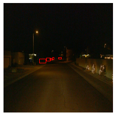
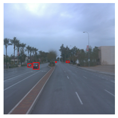
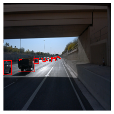
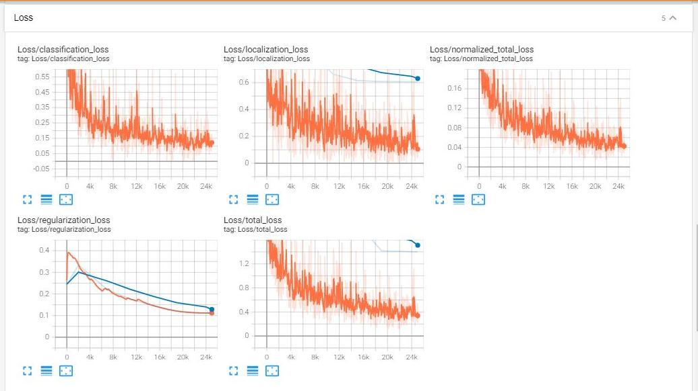
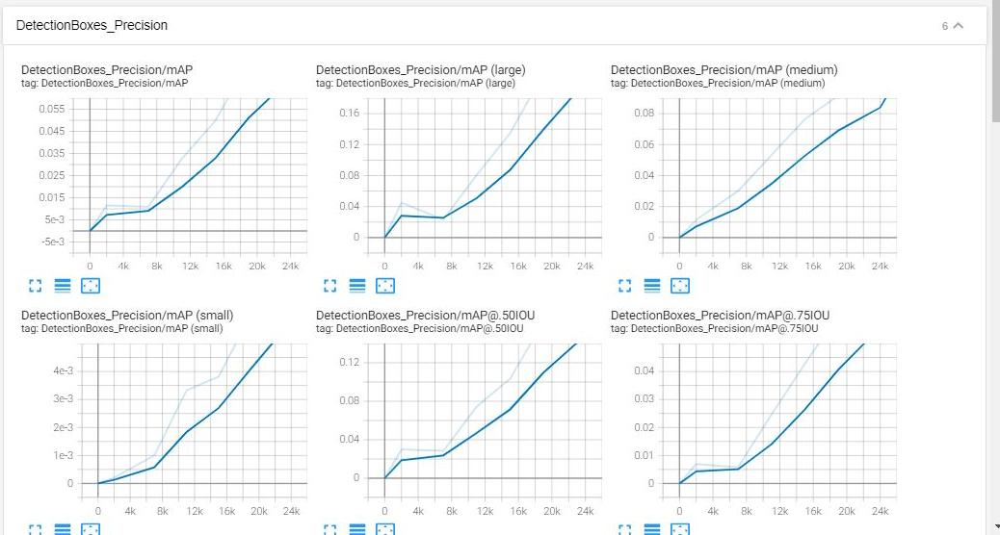
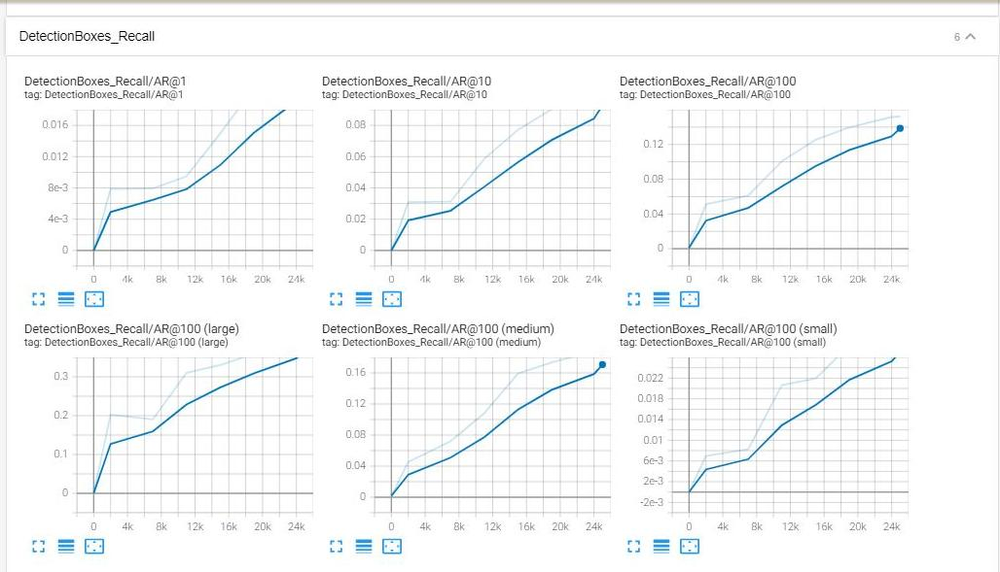
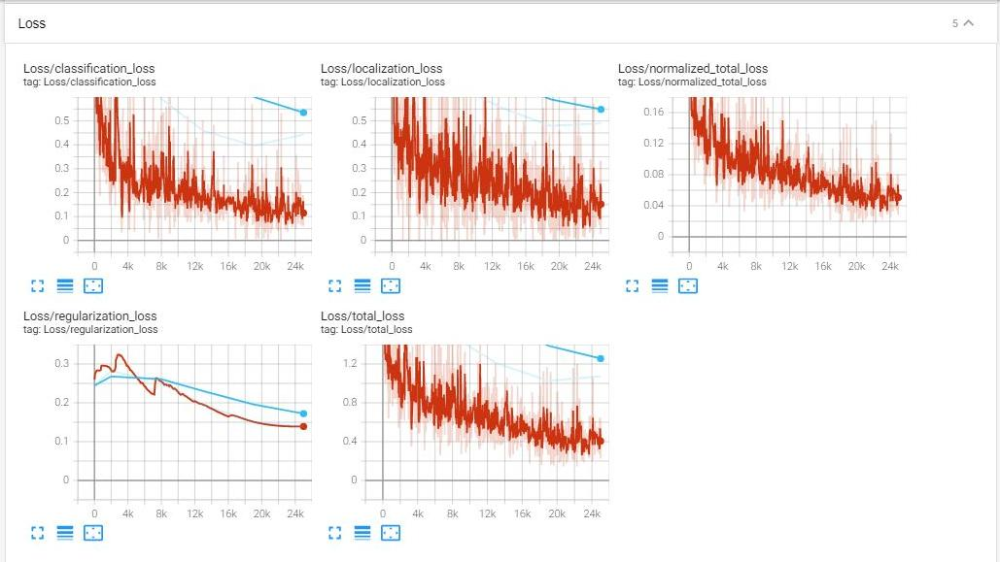
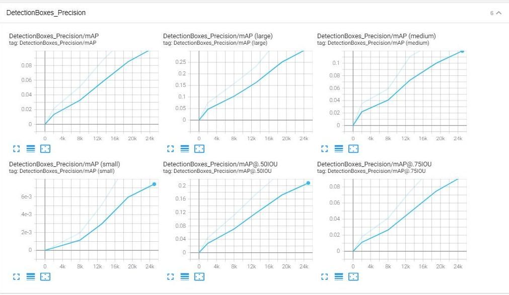
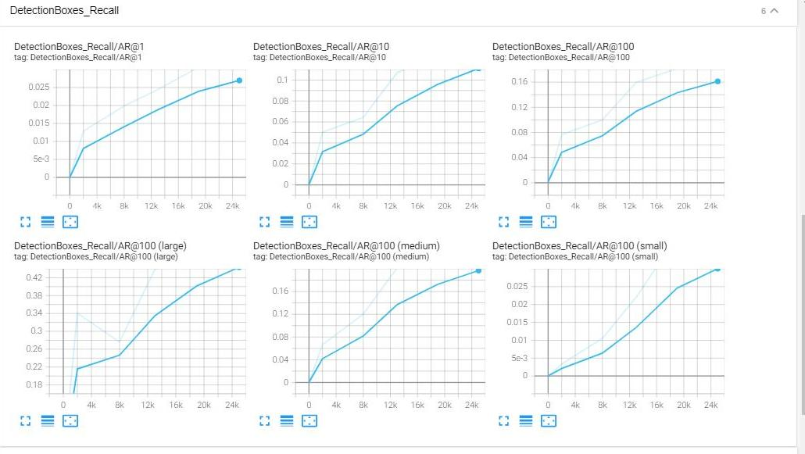

# Object Detection in an Urban Environment

## Project overview
The goal is to detect cars, pedestrians and cyclists in camera input feed.  

## Set up

For this project, we will be using data from the [Waymo Open dataset](https://waymo.com/open/).
The data required to finish this project in the workspace, had been already provided. **No download was necessary?!**  

From the instruction in the provided README.md file:  
"The `training_and_validation` folder contains file that have been downsampled: we have selected one every 10 frames from 10 fps videos.  The `testing` folder contains frames from the 10 fps video without downsampling. You will split this `training_and_validation` data into `train`, and `val` sets by completing and executing the `create_splits.py` file."  

In my workspace no `training_and_validation` folder existed. **The folders train, val and test were already there?!**
I nevertheless completed the create_splits.py file as if the setup was according to instructions.  
  
The data for training, validation and testing is organized as shown below(/home/workspace/MY-nd013-c1-vision-starter/data/):
```
    - train: contains the train data (86 files)
    - val: contains the evaluation data (10 files)
    - test - contains 3 files to test model and create inference videos
```
For this project a Github repository is provided(https://github.com/udacity/nd013-c1-vision-starter), which I forked and cloned to my workspace(https://github.com/Rakso75/nd013-c1-vision-starter).  
In this repository are all files mentioned  in the following as  "provided".  

### Experiments

For this project a pretrained SSD Resnet 50 640x640(Single Shot Detector  [here](https://arxiv.org/pdf/1512.02325.pdf)) model was suggested.
The pretrained model had to be downloaded and put into the experiments folder.  
This model is configured by the Tf Object Detection API via config files.  
The provided `pipeline.config` file is the config file for the SSD Resnet 50 640x640 model.
 It has to be adapted for every experiment with the help of also provided `edit_config.py` and `label_map.pbtxt` files. 
 A new file `pipeline_new.config` is produced and has to be placed in the folder of each experiment  
 
The experiments folder is organized as shown below:
```
    - pretrained_model/
    - exporter_main_v2.py - to create an inference model
    - model_main_tf2.py - to launch training
    - reference/ - reference training with the unchanged config file
    - experiment0/ - create a new folder for each experiment you run
    - experiment1/ - create a new folder for each experiment you run
    - experiment2/ - create a new folder for each experiment you run
    - label_map.pbtxt
    
```

## Dataset
A notebook `Exploratory Data Analysis`  is provided, in which the analysis is performed.  

### Dataset analysis
In the dataset, we have to fit rectangular bounding boxes on the images with objects ,which includes pedestrians, cyclists and cars.Images are taken from different places, and different weather conditions and at different time of the day (day/night).The image set contains diverse set of images of which some are blurry, clear, light and some are foggy or dark. A sample of 10 is shown in notebook `Exploratory Data Analysis`.  
Night
  
Foggy
  
High Contrast
  

First I analyzed the distribution of the labels. The dataset consists mostly of the labelsfor cars and pedestrians with the sample size of cyclists being very small(  for more see “Exploratory Data Analysis.ipynb”):


### Cross validation
I used 100 tfrecord files, which I shuffle the data randomly and then split into training,testing and validation sets. The reason for random shuffling is to reduce the class imbalance in each sample. The shuffling ensures approximately equal distribution of samples in the training,testing and validation datasets.

In this case I used 86 : 10 as the proportion of training and validation data since I'm using only 100 tfrecord samples. This ensures that there is sufficient data for training as well as validation.We are using 10% (0.1) of the sample as the test set to check the error rate and if the model is overfitting. Three tfrecord were for testing.

## Training
Information about the traing process I found in : https://tensorflow-object-detection-api-tutorial.readthedocs.io/en/latest/index.html 
With the created `pipeline_new.config`  and the provided `model_main_tf2.py` files training and evaluation can be started.

* training:
```
python experiments/model_main_tf2.py --model_dir=experiments/(reference or experimentX)/ --pipeline_config_path=experiments/(reference or experimentX)/pipeline_new.config
```
* evaluation:
```
python experiments/model_main_tf2.py --model_dir=experiments/(reference or experimentX)/ --pipeline_config_path=experiments/(reference or experimentX)/pipeline_new.config --checkpoint_dir=experiments/(reference or experimentX)/
```
The training was monitored with  tensorboard(https://www.tensorflow.org/tensorboard/get_started).  

### Reference experiment
The pretrained model  without augmentation , model loss is shown below:  



Initially the model was overffiting as the training loss was diverging from the validation loss.The training loss is indicated in orange and the validation loss in blue.This divergence indicates a significant error rate during model validation- an indication that the model is overfitting.
The precision and recall curves indicate that the performance of the model slowly increases, as both precision and recall start to increase. A high recall rate is often not suitable and the model performance is not that great.  

Precision:  

  

Recall:  

 


### Improve on the reference
To improve on the model performance, the first step was to augment the images by converting them to grayscale with a probability of 0.2. After this, we have clamped the contrast values between 0.6 and 1.0 such that more lighting datapoints are available for classification. A greater part of the images were a bit darker and increasing the brightness to 0.3 provided an even datapoint which could be better classified with the model.The pipeline changes are there in ```pipeline_new.config```

Augmentations applied: (see "Explore augmentations.ipynb" )

- 0.02 probability of grayscale conversion
- brightness adjusted to 0.3
- contrast values between 0.6 and 1.0  
  
How to modify the config files accordingly: https://github.com/tensorflow/models/blob/master/research/object_detection/protos/preprocessor.proto
  

The model loss with augmentation :  



Precision with Augmentation:  

  

Recall with Augmentation:

  

The loss is lower than the previous loss (un-augmented model). This is an indication of better performance. There should be more samples of augmented datapoints such as
combining the contrast values with grayscale. Brightness can also be clamped within a limit instead of fixing it to 0.3
However the most important point is to add more samples of cyclists,pedestrians which are in a low quantity in the dataset. This is an inherent requirement since model biases plays an important role in the loss curves and lesser the diversity in training samples, the lower will be the accuracy. 

I have reduced overfitting to an extent with augmentation, however better classification results would be resulting from a more balanced dataset.


